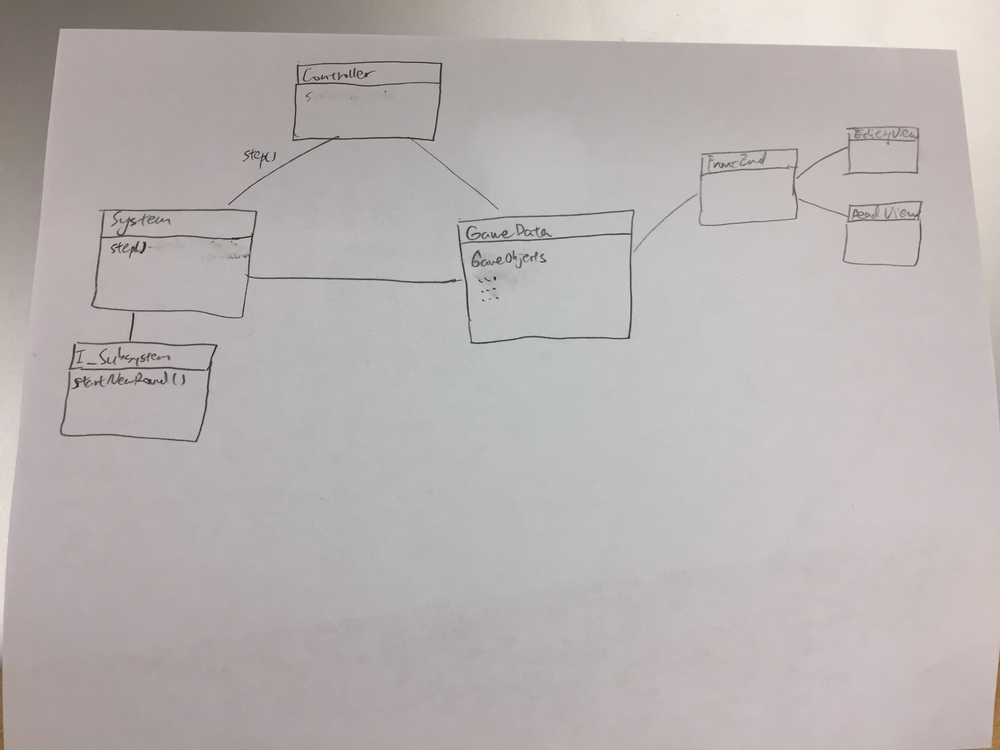
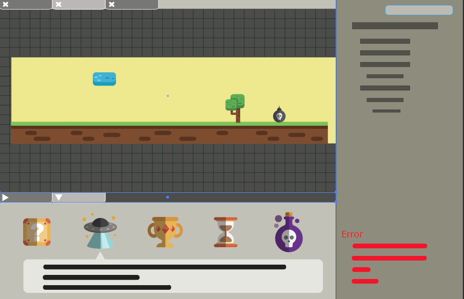
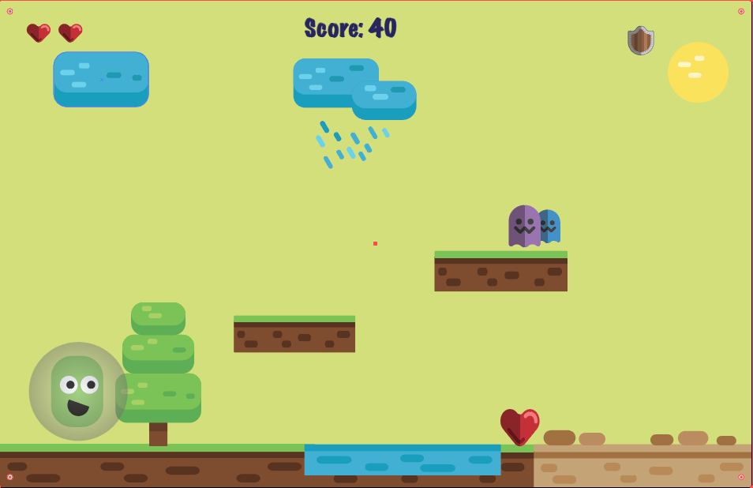

# DESIGN.md

## **Introduction**

The goal of our program is to design a game authoring environment that allows game designers to build a scrolling platformer game. The program will allow the users to save, load, edit, and play their games. Specifically, they will be able to determine the basic characteristics of the look and the feel of the game - graphical icons, IO and interactions, score system, etc.In order for the game designers to build a variety of games, our graphical authoring environment and game engine need to be especially flexible. We feel that a scrolling platformer game will allow us to have some creativities in the design of the game engine (e.g. the physics engine), which other game genres may not need.

## **Overview**

Our program is divided into six components:

1. Game Authoring Environment: Supporting the users to place game elements, assign reactions to interaction, load previously created games, etc.. Integrated with the game engine and have the access to game data. Package: gameauthoring
2. Game System: Logicalize all the game objects. In each frame, go through all game objects and check if they need to do anything. If so call the methods on the objects. Package: gamesystem.
3. Physics Engine: Provides approximate simulating calculation of the physical system of the game. Package: physicsengine
4. Game Data: Contains the data needed for running the game. The game data is able to be stored and reload. In addition, the communication between game data and game engine is essential when running the game. Package: model
5. Game Player: Game player renders the game on the screen. Package: gameplayer
6. Game Object: Define individual objects in the game such as the Character and the Brick. Package: gameobject; Sub-package of gameobject: component
7. Utilities: Provide useful utilities to use in the project. Package: util

## **User Interface**

There are two major user interface in our game engine. The first one is the game authoring environment where people and make a game. The interface for the authoring environment is composed of three major sections: development scene, gadget box and project hierarchy. The scene is where developer can drag the gadgets like a wall or a tree into. This will be the primary stage where the game happens. The gadget box contains all sorts of elements for the game, including blocks, magics, characters etc. The right hand window shows how the project is organized in a tree structure. At the bottom is the potential error of the current game stage. Building a scene should be as easy as drag the element over and drop it over the scene.

The second is the actual game play environment. Indication of the progress and score is shown on top of the game and this environment should be able to fill the whole computer screen to ensure best user experience. All inputs to the game are through the keyboard, including a change of the game mode. In later stage of the development, characters in the scene should be animated. 

## **Design Details **

* World stores all GameObjects in the game and provide different access control for front-end and back-end with different interfaces
* Editor stores Template created by the game designer, which can be used to spawn GameObject that they represent
* GameObject is the Entity whose behaviors are defined by the Components that it contains, e.g. MainCharacter, Stone. Components store data, such as Position, Velocity.
* System stores each System e.g. MoveSystem, CollideSystem, DeathSystem, BirthSystem. Each System will scan over each GameObject and ask if each Object contains the component/behavior, which each system requires.
* PhysicsEngine loops through the database and find the neighbors/objects qualifying for interactions with an object.

## **Example Games**

In the design, the way a game plays and the behavior of the games are defined by its Game Objects—the individual pieces within a game.
Ex. walls, background pieces, enemies, player controlled characters

Each Game Object has its own components that determine the Game Object's behavior. These components can be things like the 'Collider', 'Position', 'Velocity', etc.  Each component will have parameters which can be set for each Game Object, making each Game Object unique in behavior. 

Each Game Object will have a 'bitmask', where each bit corresponds to whether or not a Game Object has a component.
Ex. Game Object 'car' has components: 'Collider', 'Position', 'Velocity'. Supposed there are 10 possible components. The bitmask would be “1110000000”, where 111 indicates that 'Collider', 'Position', 'Velocity' components are present

1. Platform(er) Game (Ex. Super Mario) - For a platformer, there are a few types of Game Objects that need to be included. To build a platformer level in our design, make classes for Game Objects such as the main character. This 'main character' would have components: 'Collider', 'Position', 'Velocity', 'Acceleration' etc. In a platformer, a unique detail is that there needs to be a gravity aspect to the game. This would be defined by the 'Acceleration' component in the present Game Objects. There will also be Game Objects such as 'platform block' which would have components: 'Collider', 'Position', but maybe not 'Velocity'. 
2. Shoot 'Em Up “Bullet Hell” Game (Ex. Touhou) - For a shoot 'em up, the difference between the 'main character' game object here and the one in the platformer would be that the it has doesn't necessarily have 'Acceleration'. This would remove the gravity-like behavior that will be computed in a platformer game based on the values in 'Acceleration,' and based on the fact that the 'Acceleration' component is present. For 'bullet' Game Objects, the components it could have are 'Health', 'Movement', 'Collider', etc. Then based on these components, when a 'bullet' instance collides with a 'main character' object, the 'main character' object's health will drop, as handled by the system. 
3. Top Down Perspective RPG — or potentially implementable as a tower defense (Ex. Zelda) - The same concept can be applied here as in the “Bullet Hell” game-type. The difference could in the sprites that are used for the Game Objects. But just by changing the sprites, and the components that are given to the Game Objects, the way the game plays can be very different. For example, 'enemy' game objects could be given component the extra 'Attack' component, which could potentially take something like it's target of attack (in this case, the 'main character'). The game's system/engine would then handle this component by moving the enemy towards the 'main character' position, which is defined by the 'Position' component of the 'main character'.

## **Design Considerations **

We discussed about where to store the code specifying implementation of certain actions.  We had two options, one is to store them in the Classes representing the GameObjects. One is to open an API called setAction(Action action).

The first one made the job of System classes easier. All it has to do is to call getAction().execute(). However, all actions in this case is stored in the game objects. Their actions cannot change during run time. There may be possibilities that in different levels, the actions change. This design makes changing their behaviors hard.

However, another method is to open up setAction() API so that their actions can be set during runtime. We can store the predefined actions in our GameData. When some conditions in the game are met, we can call setAction() API. We can thus allow actions to change during the game. (For example, when the user levels up, he/she attacks using lightning bolts instead of using fists).

